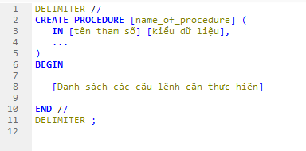
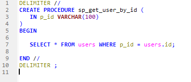
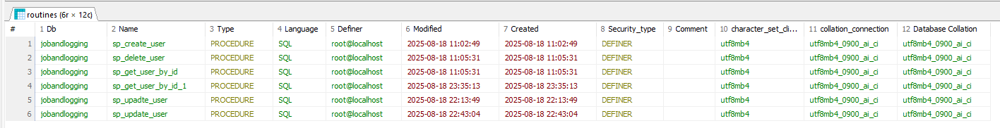

# <ins>**Stored Procedure (SP)**</ins>
## *[Tài liệu tham khảo](https://viblo.asia/p/mysql-stored-procedures-maGK7OreKj2)*

---  
## 1. Stored Procedure là gì ?
- Stored Procedure - Thủ tục lưu trữ: Là một tập khai báo các lệnh SQL nhằm thực hiện một số hoặc một chuỗi xử lí nào đó.
- SP có thể có dữ liệu trả về hoặc không, có thể trả về 1 lúc nhiều kết quả

### Ưu điểm:
- Nhanh hơn: SP sẽ được phân tích và biên dịch khi chương trình lần đầu chạy, các lần sau chỉ cần gọi 
- Tính linh động: Khai báo 1 lần và dùng nhiều lần, có thể chỉnh sữa, dễ dàng maintanence
- Bảo mật: Việc đóng gói cú pháp câu lệnh SQL từ đó ngăn chặn việc hacker sử dụng SQL injection
- Giảm băng thông: Giảm mức tải cho server tới DB do chỉ gọi thủ tục chứ không gửi một tập các câu lệnh SQL

### Nhược điểm:
- DB server sẽ tốn thêm bộ nhớ để lưu trữ các SP
- Phải hiểu và biết rõ các câu lệnh đang viết

---
## 2. Cách thêm Stored Procedure vào DB
### Cấu trúc câu lệnh của SP

- `DELIMITER`: 
  - Mặc định Delimiter của SQL là `;`, khi viết `Stored procedure` sẽ là một tập các câu lệnh kết thúc bằng `;`
  - Ta khai báo cho SQL biết rằng sẽ thay thế `;` bằng `//` và khi kết thúc một `Stored procedure` sẽ khai báo trả lại `;`
- `name_of_procedure`: Tên mà bạn định nghĩa cho`Stored procudure`, thường thì sẽ bắt đầu bằng `sp_` và tiếp theo là chức năng của nó. Ví dụ `sp_get_user_by_id`
### Ví dụ: Lấy những bản ghi User có trường ID giống với tham số ID truyền vào

---
### *Các câu lệnh thường dùng khi thao tác với Stored Procedure*
#### <ins>Xem danh sách các SP có trong DB<ins>
- `SHOW PROCEDURE STATUS WHERE Db = 'name_db';`

##### Kết quả:

#### <ins>Xóa một stored procedure hiện có trong DB<ins>
- `DROP PROCEDURE IF EXITS [procedure_name];`

---
# <ins>**Logging**</ins>

